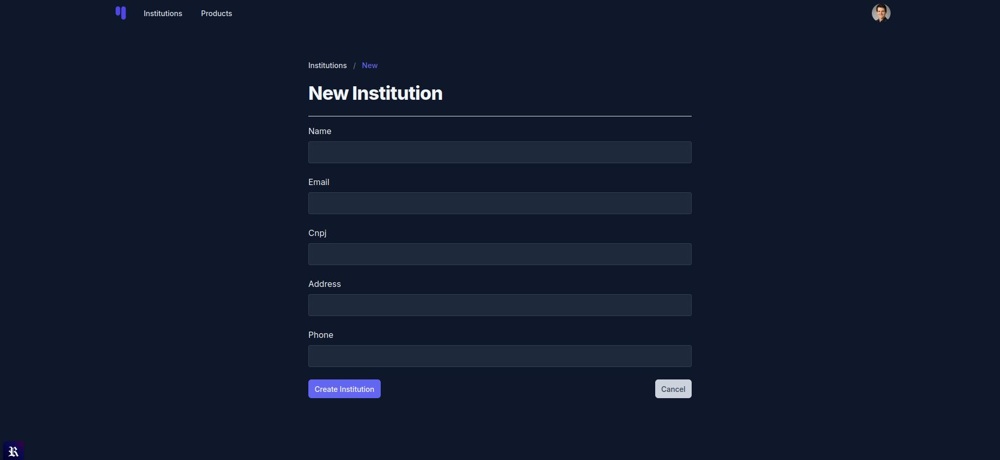
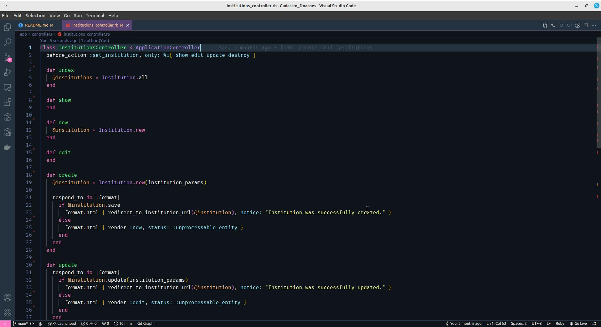
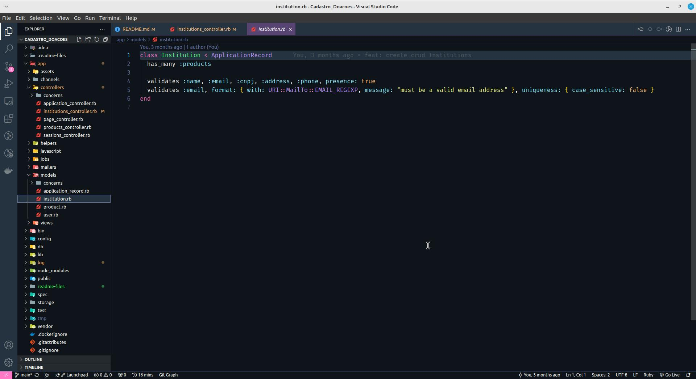

# Cadastro Doações


##### Projeto Ruby on Rails desenvolvido para facilitar o cadastro de instituições de caridade e gerenciar uma lista de produtos necessários para doações. O projeto visa conectar doadores às instituições, promovendo um processo eficiente e organizado para atender às necessidades das instituições.




 ## Configuração

### RailsUI

#### Gemfile
```
bundle install
```

#### Node.js
```
npm install
```

#### Instalar RailsUI
```
rails railsui:install
```

#### Migrar Banco de Dados
```
rails db:drop && rails db:create && rails db:migrate && rails db:seed RAILS_ENV=development
```

#### Redis
```
redis-server
```

#### Executando o Servidor
```
bin/dev
```

### Docker

#### Criando
```
docker-compose up --build
```

#### Executando
```
docker compose up
```
```
docker-compose run web rails db:create
```
```
docker-compose run web rails db:migrate
```
```
docker-compose run web rspec
```


 